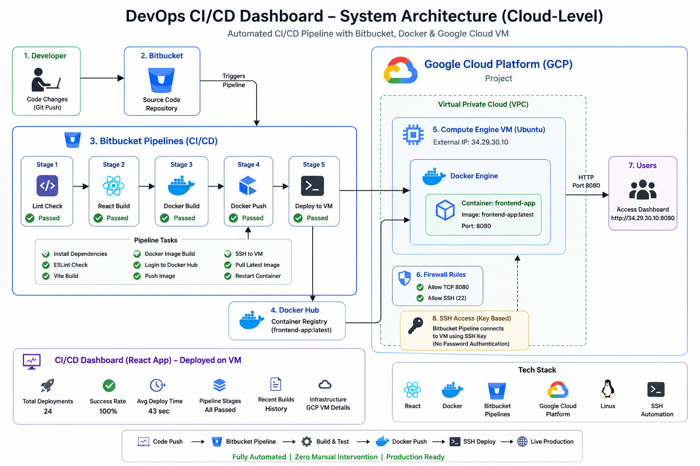

# 🚀 Frontend Docker CI/CD Deployment

A production-ready frontend deployment project demonstrating a complete CI/CD pipeline using Bitbucket Pipelines, Docker, Docker Hub, and Google Cloud Platform.

## 📌 Project Overview

This project automates the build, packaging, and deployment of a React frontend application to a Google Cloud VM.

Every push to the `main` branch automatically triggers:

1. Code lint checks
2. Production build
3. Docker image creation
4. Push to Docker Hub
5. SSH deployment to GCP VM
6. Container restart with latest version

---

## 🛠 Tech Stack

* React + Vite
* Docker
* Bitbucket Pipelines
* Docker Hub
* Google Cloud Compute Engine
* Linux
* SSH Keys

---

## ⚙️ CI/CD Architecture

Developer Push → Bitbucket Repository → Bitbucket Pipeline

Pipeline Stages:

* Lint Check
* Build React App
* Build Docker Image
* Push to Docker Hub
* SSH into GCP VM
* Pull Latest Image
* Restart Container

---

## 🌍 Live Deployment

Application running on GCP VM:

`http://34.29.30.10:8080`

---

## 📁 Project Structure

```bash
.
├── src/
├── public/
├── Dockerfile
├── bitbucket-pipelines.yml
├── package.json
└── README.md
```

---

## 🐳 Docker Commands

Build locally:

```bash
docker build -t frontend-app .
```

Run locally:

```bash
docker run -d -p 8080:80 frontend-app
```

---

## 🔐 Environment Variables Used

Configured securely in Bitbucket Repository Variables:

* `DOCKER_USERNAME`
* `DOCKER_PASSWORD`
* `SSH_PRIVATE_KEY_B64`

---

## 💡 Challenges Solved

* SSH authentication failures
* Firewall port access
* CI/CD YAML debugging
* Docker image redeployment
* Secure remote server access

---

## 📈 Key Learnings

This project helped build practical knowledge of:

* Continuous Integration
* Continuous Deployment
* Containerization
* Cloud VM operations
* Linux server administration
* Secure deployments

---


---

## 🚀 Live System

🌐 Production URL:
http://34.29.30.10:8080/

---

## 📊 Features

- Real-time CI/CD dashboard UI
- Deployment counter tracking
- Pipeline success monitoring
- Build history visibility
- Infrastructure overview (GCP VM, container, ports)
- Auto deployment after git push

---

## 🛠️ DevOps Highlights

- Bitbucket Pipelines multi-stage CI/CD
- Docker image build & deployment automation
- Secure SSH key-based VM deployment
- Firewall and networking configuration on GCP
- Production container lifecycle management
- Debugging pipeline authentication issues

---

## 📚 Key Learnings

- Real-world CI/CD pipeline design
- Debugging SSH public key authentication issues
- GCP VM deployment & firewall configuration
- Docker container production deployment
- Handling pipeline failures in production systems

---

## 💡 Architecture


## 👨‍💻 Author

Shivam Upadhyay

If you found this project interesting, feel free to connect on LinkedIn.
